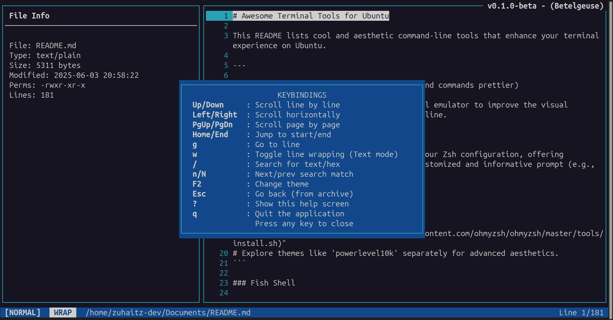
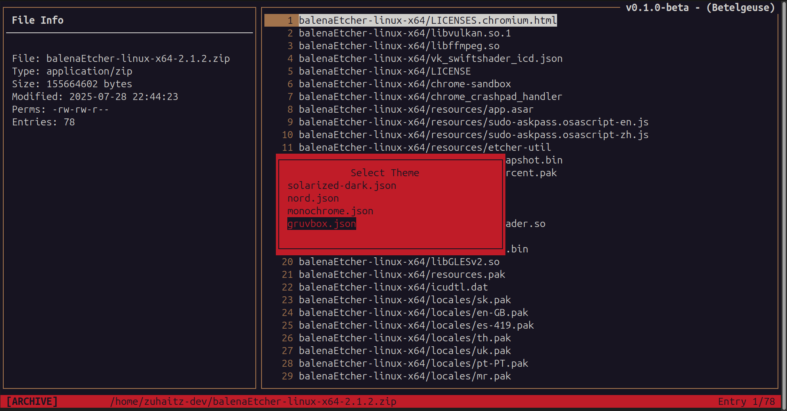
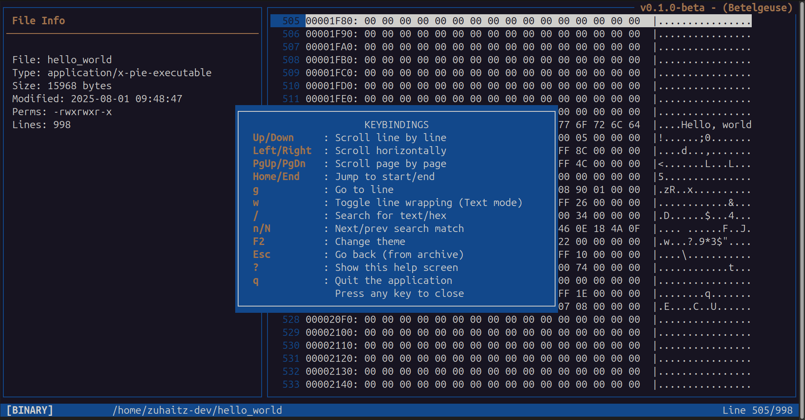

# FAT - File & Archive Tool

<table>
  <tr>
    <td width="120" valign="middle">
      
    </td>
    <td valign="middle">
      <strong>FAT</strong> is a modern, TUI-based file and archive viewer for your terminal. It's designed for developers and power users who want to quickly inspect files and peek inside archives like <code>.zip</code> and <code>.tar</code> without having to extract them first. It is lightweight, fast, and highly extensible.
    </td>
  </tr>
</table>

## Features

- **Unified Viewer**: Inspect regular text files, binary files (in a hex-dump view), and archive contents all in one interface.
- **Plugin Architecture**: FAT uses a dynamic plugin system to handle different archive formats. The beta version comes with support for ZIP and TAR archives.
- **Customizable Theming**: Easily change the look and feel of the application. FAT uses simple `.json` files for theming and comes with several pre-built themes, including Nord, Gruvbox, Monochrome, and Solarized.
- **User-Friendly TUI**: A clean, two-pane layout shows file metadata on the left and content on the right.
- **Cross-Platform**: Designed to compile and run on Linux, macOS, and ~~Windows (via MinGW-w64)~~.

> NOTE: At the current version, **Windows** is not available. Linux and macOS are available completely though.

---

## Screenshots

| | | |
| :---: | :---: | :---: |
|  |  |  |

---

## Installation (AppImage - Recommended for Linux)

The easiest way to get started is by downloading the latest Binaries or AppImage.

#### 1. Download the Binary or AppImage
  Go to the project's [Releases Page](https://github.com/Zuhaitz-dev/fat/releases/) on GitHub and download the file for your system and arch.

#### 2. Make it Executable
  You only need to do this once.

```bash
chmod +x <file you downloaded>
```

#### 3. Run it!
  You can now run the application directly

for binary
```bash
./fat-x86_64 /path/to/your/file
```
or for Appimage
```bash
./fat-x86_64.AppImage /path/to/your/file
```

> **Desktop Integration**: For the best experience, we recommend installing [AppImageLauncher](https://github.com/TheAssassin/AppImageLauncher/releases). It will automatically add FAT to your application menu.

## Building from Source

1. **Prerequisites**

First, you need to install the necessary development libraries.

### Linux (Debian/Ubuntu)

```bash
sudo apt update
sudo apt install build-essential libncursesw5-dev libmagic-dev libzip-dev libtar-dev
```

### Linux (Fedora/RHEL/CentOS)

```bash
sudo dnf install ncurses-devel file-devel libzip-devel libtar-devel
```

### macOS

Using [Homebrew](https://brew.sh/):

```bash
brew install ncurses libmagic libzip libtar
```

<details>
<summary><h3>Windows (Not available yet)</h3></summary>

The recommended way is to use MSYS2 with the MinGW-w64 toolchain.

- [Install MSYS2](https://www.msys2.org/).
- From the MSYS2 MinGW 64-bit terminal, install the toolchain and libraries:

```bash
pacman -S mingw-w64-x86_64-toolchain mingw-w64-x86_64-ncurses mingw-w64-x86_64-file mingw-w64-x86_64-libzip mingw-w64-x86_64-libtar
```
</details>

2. **Build Commands**

Once you have the prerequisites, you can build and install FAT with these simple commands:

```bash
# 2. Build the application and plugins
make

# 3. Install the application system-wide
sudo make install

# 4. (Linux only) Update the shared library cache
sudo ldconfig
```

The `fat` command will now be available system-wide.

3. **Cleaning Up**

Two cleaning commands are available:

- `make clean`: Removes intermediate object files and binaries from the compilation process.
- `make distclean`: Performs a full cleanup. It runs `clean` first and then **deletes the** `AppDir/` **and any created AppImage files**, restoring the project to a pristine state.

## Usage

To view a file or archive, simply pass it as an argument:

```bash
fat my_document.txt
fat project.zip
```

### Some keybindings

| Key           | Actions                                   | 
| ------------- | ----------------------------------------- |
| `Up` / `Down` | Navigate through files or scroll content  |
| `Enter`       | View a file within an archive             |
| `Esc`         | Go back to the parent archive/directory   |
| `q`           | Quit the application                      |
| `F2`          | Open the theme selector menu              |
| `/`           | Search for text (or hex in binary view)   |
| `n` / `N`     | Go to the next/previous search result     |
| `?`           | Show the in-app help screen               |

#### Also supports Vim-like keybindings - j / k, h / l, gg / G

## Customization

FAT is designed to be easily customized. On the first run, it will create a configuration directory at `~/.config/fat/` (on Linux/macOS) or `%APPDATA%\fat` (on Windows).

This directory will be populated with default themes. To create your own theme or modify an existing one, simply edit the `.json` files in the `~/.config/fat/themes/` directory. Your personal themes will automatically override the system-wide defaults.

## Extending FAT (Plugin Development)

Want to add support for another archive format like `.7z` or `.rar`? It's easy! The plugin system is designed to be simple.

1. Include the `plugin_api.h` header in your C file.

2. Implement the four required functions: `can_handle`, `list_contents`, and `extract_entry`.

3. Export a `plugin_register` function that returns a struct of your function pointers.

4. Compile your plugin as a shared library (`.so`, `.dll`, or `.dylib`) and place it in the plugins folder.

For a complete example, see the implementations for `zip_plugin.c` and `tar_plugin.c`.

<!-- It is recommended to move the "Customization" and "Extending FAT" sections to a separate `DEVELOPMENT.md` file in a `docs/` folder to keep the main README focused on users. -->

## License

This project is licensed under the MIT License. See the LICENSE file for details.
